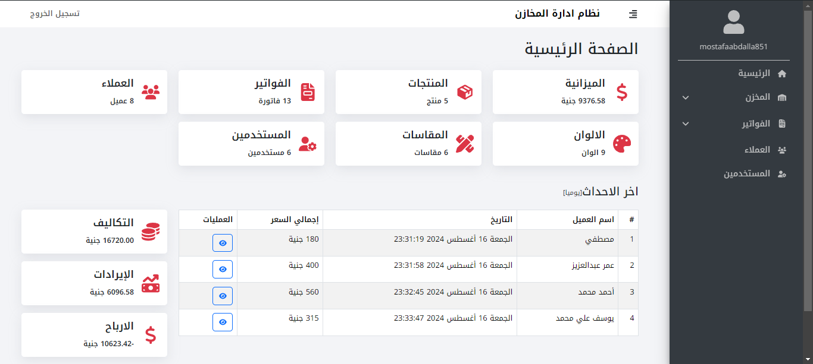
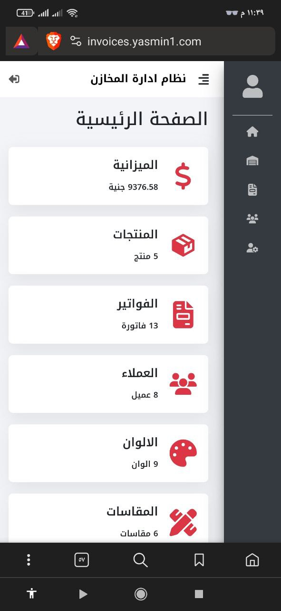

# Inventory Management System

A web-based application designed to help businesses manage their inventory efficiently. This system allows users to add, edit, and delete products, track inventory levels, and organize product data with ease. Built using React for the front end and Laravel for the backend, this application provides a seamless and user-friendly interface for interacting with inventory data.


## Project Link

The project is live and can be accessed at: [Inventory Management System](https://invoices.yasmin1.com/)

## Screenshots

### Desktop View


### Mobile View


## Features

- **Product Management**: Add, edit, and delete products and invoices in the inventory.
- **Inventory Tracking**: Keep track of stock levels and ensure that products are always available.
- **User-Friendly Interface**: Simple and intuitive design for easy navigation and use.
- **Responsive Design**: Optimized for both desktop and mobile devices.

## Technologies Used

- **Frontend**: React.js ,Redux Toolkit ,SCSS , Bootstrap css 
- **Backend**: Laravel
- **Database**: MySQL
- **API**: RESTful APIs
- **Tools**: VS Code, Postman , PHPstorm , MySQL Database , XAMPP
- **Deployment**: Hosenger

## Installation

To run this project locally, follow these steps:

### Frontend

1. **Clone the frontend repository**:
   ```bash
   git clone https://github.com/MAbdallaDev/inventory-mangement-system.git
2. **Navigate to the project directory**:
   ```bash
   cd inventory-mangement-system/frontend
3. **Install dependencies**:
   ```bash
   npm install
4. **Start the development server**:
   ```bash
   npm start
The application will be available at http://localhost:3000.

### Backend
1. **Navigate to the backend project directory**:
   ```bash
   cd inventory-mangement-system/backend
   ```
2. **Install dependencies**:
   ```bash
   composer install
3. **Set up environment variables**:
   ```Copy the .env.example file to .env and configure your database and other settings.```
4. **Generate application key:**:
   ```bash
   php artisan key:generate
5. **Run database migrations**:
   ```bash
   php artisan migrate
5. **Start the Laravel server:**:
   ```bash
   php artisan serve
   ```

The backend will be available at http://localhost:8000.

### Team
- **Frontend Development**: [Mostafa Abdallah](https://www.linkedin.com/in/mostafa-abdallah0/)
- **Backend Development**: [Ahmed Ali](https://github.com/Ahmed2021Ali)